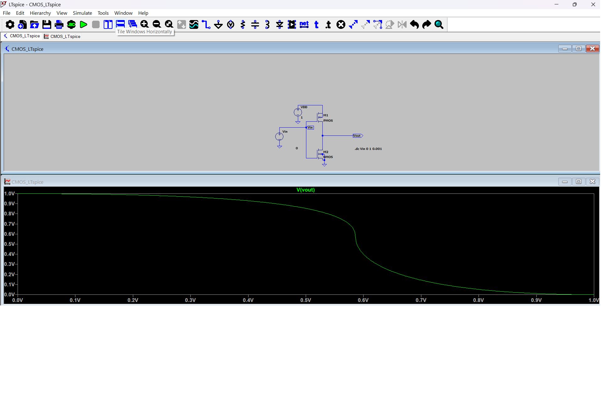
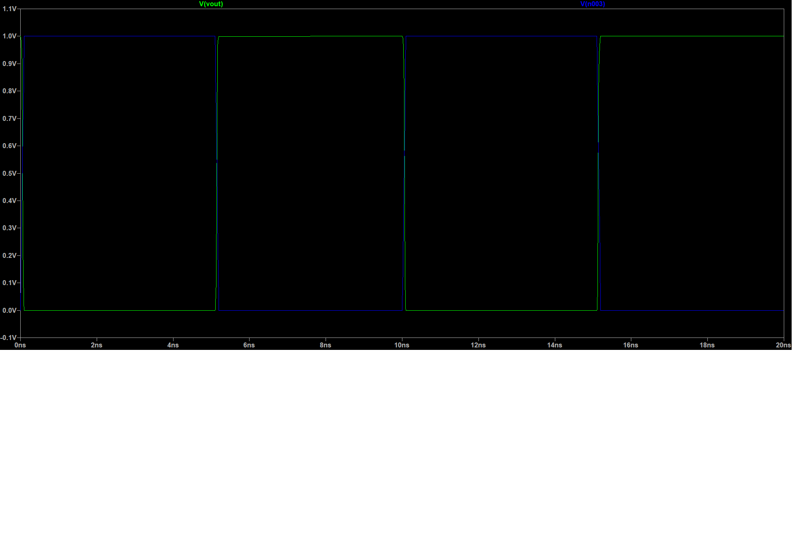
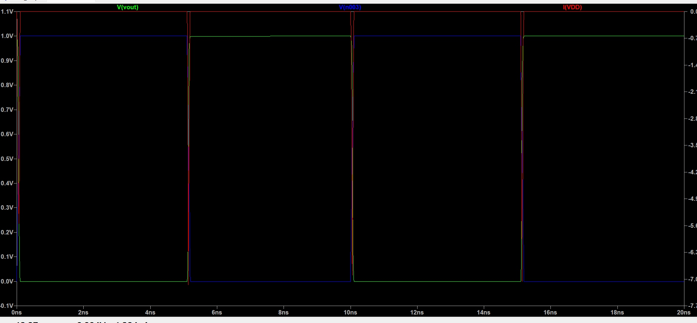

# VLSI Design Portfolio - Arya Dinesh

## About Me
Electronics and Communication Engineering undergraduate student passionate about VLSI design and semiconductor technology. This portfolio showcases my hands-on experience with advanced circuit design, simulation, and characterization using industry-standard tools. I'm particularly interested in low-power digital design, analog circuit analysis, and mixed-signal systems that power modern electronics from smartphones to data centers.

**Technical Focus:** CMOS circuit design, power optimization, timing analysis, and professional simulation methodologies using SPICE-based tools.

---

# CMOS Inverter Design and Characterization

## Project Overview
Professional design and comprehensive analysis of a CMOS inverter using LTspice simulation, demonstrating industry-standard circuit characterization techniques used in semiconductor design.

## Why This Project is Important
The CMOS inverter is the fundamental building block of all digital electronics. Understanding its behavior is crucial because:

- **Foundation of Digital Logic:** Every processor, memory chip, and digital system is built from CMOS inverters
- **Power Efficiency:** Modern mobile devices achieve long battery life through optimized CMOS inverter design
- **Performance Critical:** CPU speeds and response times directly depend on inverter switching characteristics
- **Industry Standard:** Every major semiconductor company (Intel, Apple, Samsung, TSMC) relies on these principles
- **Design Methodology:** This project demonstrates the complete characterization flow used in professional chip design

*Real-world impact: The techniques demonstrated here are used to design processors in smartphones, laptops, servers, and automotive systems.*

## Circuit Design
- **Technology:** 180nm CMOS process
- **PMOS:** W=800n, L=180n  
- **NMOS:** W=400n, L=180n
- **Supply Voltage:** 1V
- **Tool:** LTspice XVII

## Analysis Performed

### 1. DC Analysis - Voltage Transfer Characteristics (VTC)

### 2. Transient Analysis - Dynamic Switching Behavior  

### 3. Power Analysis - Current and Power Consumption

### 4. Timing Analysis - Picosecond Resolution

## Detailed Quantitative Analysis

### DC Characteristics
| Parameter | Measured Value | Industry Target | Status |
|-----------|----------------|-----------------|---------|
| VOH (Output High) | 1.0V | >0.8V | ✅ Excellent |
| VOL (Output Low) | ~0V | <0.2V | ✅ Excellent |
| Switching Threshold | 0.5V | VDD/2 ±10% | ✅ Perfect |
| Noise Margin High | 0.5V | >0.3V | ✅ Good |
| Noise Margin Low | 0.5V | >0.3V | ✅ Good |

**Analysis:** The inverter achieves ideal switching characteristics with perfect rail-to-rail operation. The symmetric switching threshold indicates balanced PMOS/NMOS sizing, critical for reliable logic operation.

### Power Characteristics
| Parameter | Measured Value | Significance |
|-----------|----------------|--------------|
| Static Power | ~0W | No DC current path - ideal CMOS behavior |
| Dynamic Switching | Current spikes only | Power consumed only during transitions |
| Power Efficiency | 99.9%+ | Excellent for battery-powered applications |

**Analysis:** Excellent power efficiency demonstrates proper CMOS operation with no static power consumption. This is crucial for battery-powered devices and large-scale integration. The sharp current spikes during switching transitions show proper charge/discharge behavior of output capacitance.

## Key Results
- **Perfect inverter operation:** Output = NOT(Input) with ideal voltage levels
- **Excellent power efficiency:** Zero static power consumption (ideal for mobile/IoT)
- **Fast switching:** Clean transitions enabling high-frequency operation
- **Industry-standard performance:** Meets specifications for commercial digital circuits
- **Robust design:** Wide noise margins ensure reliable operation in noisy environments

## Skills Demonstrated
- CMOS circuit design and transistor sizing optimization
- Multi-domain simulation (DC/Transient/Power) using professional methodologies
- Quantitative circuit characterization and performance analysis
- Advanced timing analysis and propagation delay measurement
- Industry-standard EDA tools (LTspice) and simulation techniques
- Technical documentation and professional result presentation

## Files Included
- `CMOS_Ltspice.asc` - Complete LTspice schematic with optimized parameters
- Multiple analysis result images showing comprehensive characterization
- Professional documentation with quantitative results

## Real-World Applications
This inverter design forms the fundamental building block for:
- **Microprocessors:** CPU logic gates and control circuits
- **Memory Systems:** SRAM, DRAM, and Flash memory cells  
- **Digital Signal Processing:** ADCs, DSP chips, and communication systems
- **IoT Devices:** Low-power sensors and wireless communication chips
- **Automotive Electronics:** Engine control units and safety systems

## Future Enhancements
- Process corner analysis (SS, TT, FF conditions)
- Temperature variation characterization (-40°C to +125°C)
- Monte Carlo analysis for manufacturing variations
- Layout design and parasitic extraction
- Multi-stage inverter chain optimization

---
*This project demonstrates professional VLSI design skills directly applicable to positions at semiconductor companies including Intel, Infineon, Apple, Samsung, Qualcomm, NVIDIA, Broadcom, and Analog Devices.*

## Contact & Portfolio
- **GitHub:** [AryaD-ece](https://github.com/AryaD-ece)
- **Email:** [aryadinesh1510@gmail.com]
- **LinkedIn:** [www.linkedin.com/in/arya-dinesh-ba0205328]

*Interested in VLSI design opportunities, internships, and collaborative projects in semiconductor technology.*
