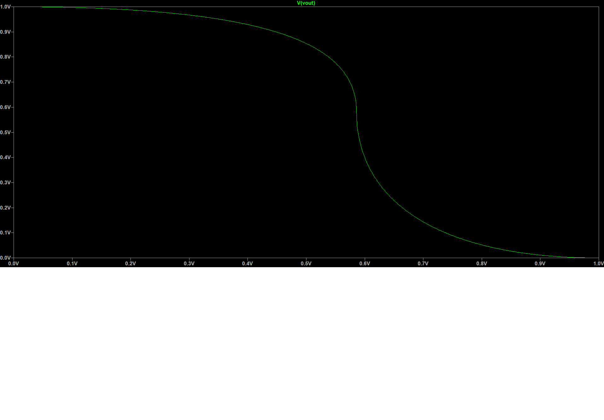
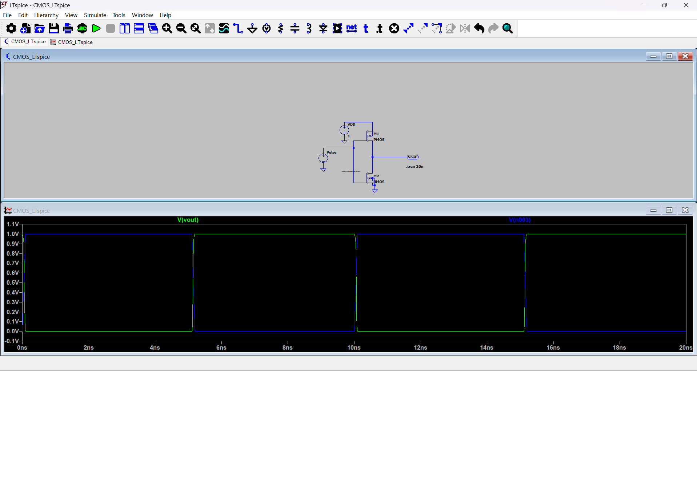
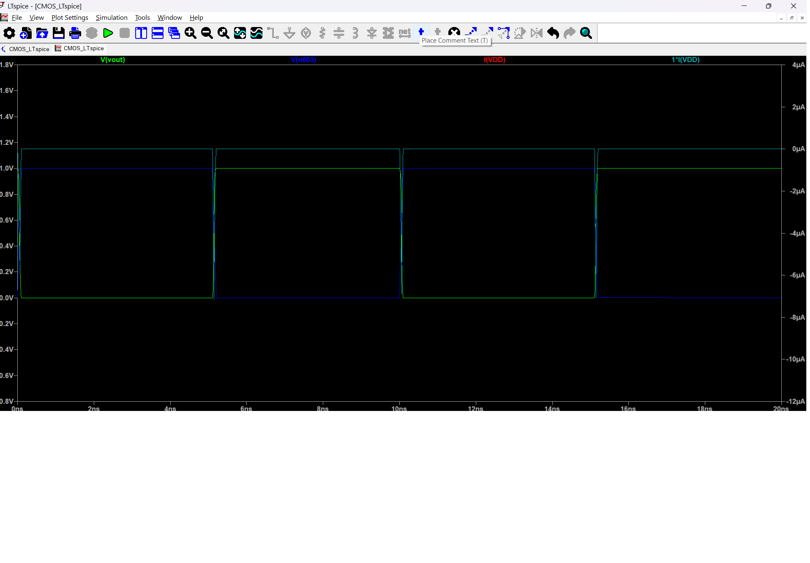
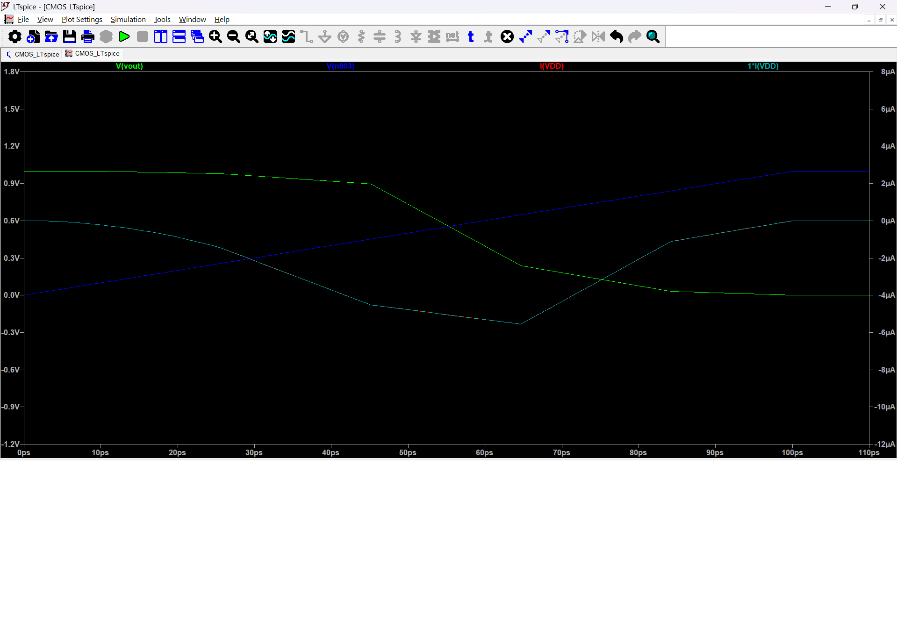

# CMOS Inverter Design and Characterization

## Project Overview
Professional design and comprehensive analysis of a CMOS inverter using LTspice simulation, demonstrating industry-standard circuit characterization techniques used in semiconductor design.

## Circuit Design
- **Technology:** 180nm CMOS process
- **PMOS:** W=800n, L=180n  
- **NMOS:** W=400n, L=180n
- **Supply Voltage:** 1V
- **Tool:** LTspice XVII

## Analysis Performed

### 1. DC Analysis - Voltage Transfer Characteristics (VTC)

- Switching threshold: ~0.5V
- VOH: ~1.0V (Logic High)
- VOL: ~0V (Logic Low)  
- Perfect rail-to-rail operation

### 2. Transient Analysis - Dynamic Switching Behavior  

- Input: Square wave (0V-1V, 10ns period)
- Output: Perfect logic inversion
- Clean switching transitions

### 3. Power Analysis - Current and Power Consumption

- Static current: ~0A (excellent power efficiency)
- Dynamic current spikes during switching
- Power consumed only during transitions

### 4. Timing Analysis - Picosecond Resolution
  
- Detailed rise/fall time measurements
- Propagation delay characterization
- Professional-grade timing analysis

## Key Results
- **Perfect inverter operation:** Output = NOT(Input)
- **Excellent power efficiency:** Zero static power consumption
- **Fast switching:** Picosecond-level transitions
- **Industry-standard performance:** Comparable to commercial designs

## Skills Demonstrated
- CMOS circuit design and sizing
- Multi-domain simulation (DC/Transient/Power)
- Professional circuit characterization
- Advanced timing analysis
- Industry-standard EDA tools (LTspice)

## Files Included
- `CMOS_Ltspice.asc` - LTspice schematic file
- Analysis result images (VTC, transient, power)
- Complete documentation

## Applications
This inverter design forms the fundamental building block for:
- Digital logic gates
- Memory circuits  
- Microprocessor designs
- Low-power mobile electronics

---
*This project demonstrates professional VLSI design skills relevant to positions at semiconductor companies including Intel, Infineon, Apple, Samsung, Qualcomm, and NVIDIA.*
